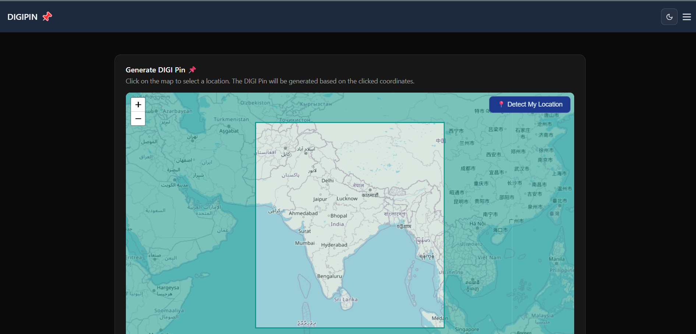

# DIGIPIN API by Department of Posts

<div align="center" style="display: flex; justify-content: center; align-items: center; gap: 20px;">
  
  
</div>

## A Geospatial Addressing Solution by India Post

DIGIPIN (Digital PIN) is a 10-character alphanumeric geocode developed by the Department of Posts, India. It provides a precise, user-friendly way to encode geographic coordinates that can be easily shared and decoded back to latitude/longitude pairs.

This open-source Node.js project exposes a public API to generate and decode DIGIPINs, supporting geolocation services, postal logistics, and spatial analysis applications.

[](https://opensource.org/licenses/Apache-2.0)
[](https://nodejs.org/)
[](https://expressjs.com/)

---

## 🏛️ About DIGIPIN

The Department of Posts has undertaken an initiative to establish a Digital Public Infrastructure (DPI) for a standardized, geo-coded addressing system in India. DIGIPIN represents the foundation layer of this infrastructure.

Developed in collaboration with IIT Hyderabad and NRSC (National Remote Sensing Centre, ISRO), DIGIPIN is an open-source national-level addressing grid that serves as a key component of India's digital address ecosystem.

After extensive public consultation and expert review, the DIGIPIN Grid has been finalized to provide simplified addressing solutions for seamless delivery of public and private services, enabling "Address as a Service" (AaaS) across the country.

### Key Highlights

- **Uniform Referencing Framework**: Provides logical, precise location identification both offline and online
- **GIS Integration**: Bridges the gap between physical and digital addresses
- **Cross-Sector Support**: Enhances service delivery across emergency response, e-commerce, logistics, BFSI, and governance
- **Policy Alignment**: Complies with the National Geospatial Policy 2022, enriching India's geospatial knowledge stack

DIGIPIN simplifies address management and enhances service delivery accuracy, promoting a thriving geospatial ecosystem for India's digital economy.

---

## ✨ Features

- **Encode**: Convert latitude and longitude into a compact 10-character DIGIPIN
- **Decode**: Transform a DIGIPIN back to its center-point coordinates
- **Lightweight**: Optimized for performance and minimal resource usage
- **RESTful API**: Clean, standard-compliant endpoints
- **Interactive Documentation**: Comprehensive Swagger UI for easy exploration
- **Production-Ready**: Built with Node.js and Express for reliability

---

## 📦 Installation

### Prerequisites

- Node.js (v14 or higher)
- npm (v6 or higher)

### Getting Started

1. **Clone the Repository**

```bash
git clone https://github.com/CEPT-VZG/digipin.git
cd digipin
```

2. **Install Dependencies**

```bash
npm install
```

3. **Environment Setup**

Create a `.env` file in the project root with the following variables:

```
PORT=5000
NODE_ENV=development
```

4. **Start the Server**

```bash
npm start
```

For development with hot reloading:

```bash
npm run dev
```

The API will be available at `http://localhost:5000`.

---

## 🚀 API Usage

### Encode Coordinates to DIGIPIN

```
GET /api/digipin/encode?latitude=12.9716&longitude=77.5946
```

**Response:**

```json
{ "digipin": "4P3-JK8-52C9" }
```

### Decode DIGIPIN to Coordinates

```
GET /api/digipin/decode?digipin=4P3-JK8-52C9
```

**Response:**

```json
{ "latitude": "12.971601", "longitude": "77.594584" }
```

### Interactive API Documentation

Access the Swagger UI documentation at:

```
http://localhost:5000/api-docs
```

---

## 🔧 Contributing

Contributions are welcome! Please feel free to submit a Pull Request.

1. Fork the repository
2. Create your feature branch (`git checkout -b feature/amazing-feature`)
3. Commit your changes (`git commit -m 'Add some amazing feature'`)
4. Push to the branch (`git push origin feature/amazing-feature`)
5. Open a Pull Request

Please ensure your code adheres to the existing style and passes all tests.

---

## 📜 License

This project is licensed under the Apache License, Version 2.0 - see the [LICENSE](LICENSE) file for details.

---

## 🙏 Acknowledgements

- Department of Posts, Government of India
- Indian Institute of Technology, Hyderabad
- National Remote Sensing Centre, ISRO

---

_Transforming addresses for Digital India_

## 🎨 New UI Improvements

### 👨🏻‍💻 Developed by: [Abhijit47](https://github.com/Abhijit47)

Github: [Abhijit47](https://github.com/Abhijit47)
LinkedIn: [Abhijit Karmakar](https://www.linkedin.com/in/abhijit-karmakar/)

Date: June 8, 2025

I was designed a straight forward and user-friendly interface for the DIGIPIN API. The new UI focuses on simplicity and ease of use, allowing users to quickly encode and decode DIGIPINs without any hassle.

### Key Features of the New UI

- **Clean Design**: A modern, minimalist layout that emphasizes functionality
- **Responsive**: Works seamlessly on both desktop and mobile devices
- **Intuitive Navigation**: Easy access to encode and decode functionalities
- **Real-time Feedback**: Instant results displayed as you input coordinates or DIGIPINs
- **Error Handling**: Clear messages for clicking outside boundry
- **Accessibility**: Designed with accessibility in mind, ensuring all users can interact with the interface
- **Dark Mode**: Option to switch between light and dark themes for user preference
- **Interactive Elements**: Buttons designed for easy interaction, with hover effects and clear labels

### Technical Details

The new UI is built using modern web technologies, ensuring fast load times and smooth interactions.

- **Framework**: Next.js for server-side rendering and static site generation
- **Styling**: Tailwind CSS for responsive and customizable design
- **Ui Components**: Shadcn/ui for pre-built, accessible components
- **State Management**: React hooks for managing application state
- **Deployment**: Hosted on Vercel for optimal performance and scalability

Preview Image: 
Preview the new UI at [DIGIPIN UI](https://nxt-digipin.vercel.app/).
